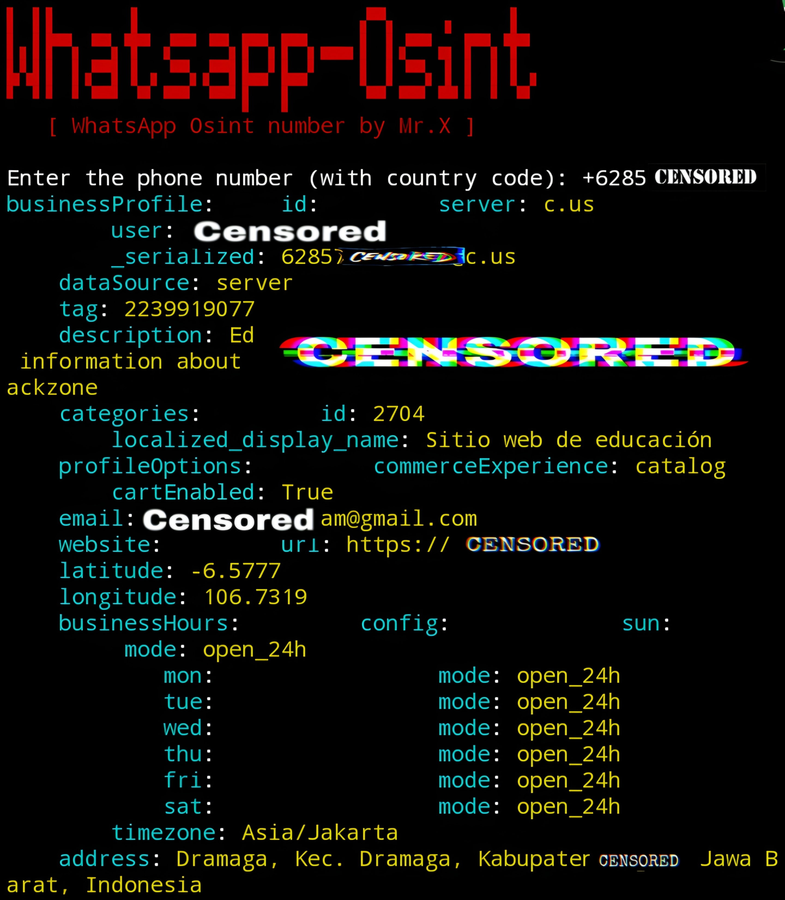

# Whatsapp-Osint


## introduction
Whatsapp-Osint is a special osint tool for searching data from target telephone numbers including its status, photo, etc.

## Instalations
```
$ pkg update -y && pkg upgrade -y
$ apt update -y && apt upgrade -y
$ pkg install git
$ pkg install python -y
$ git clone https://github.com/Whomrx666/Whatsapp-Osint.git
$ cd Whatsapp-Osint 
$ pip install -r requirements.txt
$ python3 Whatsapp-Osint.py
```
# 🗝️ API Key
Get your API key.

Name | Key |
| ------------------- |-------------- |
| [Whatsapp Data](https://rapidapi.com/airaudoeduardo/api/whatsapp-data1) | 🗝️ (Necessary) |

- Select the free plan {limited and not all target data will appear it is recommended to upgrade apikey}.

## Warning!
When you have your API key, you can add it to the **.env** file Replacing **"Your_Api_Key"** with your actual RapidAPI key and save the changes.

## Note
All data obtained depends on the apikey. If you want full scanning and no limits, just upgrade your apikey on the website above.

## Instructions
- **first**: Install tools according to the instructions above.
- **second**: Make sure you have logged in to the website above to get the WhatsApp API key.
- **third**: Install apikey in the .env folder to upgrade your apikey, it's up to you, but I have provided a free and limited apikey.
- **last**: After everything is finished, just go to the tools and enter the target telephone number, then the tools will automatically search for the target telephone number data.

## Observation
This is a tool for education only, I am not responsible for any misuse
### Original Author
<a href="https://github.com/Whomrx666"></a>

### <<< If you copy , Then Give me The Credits >>>

## CONNECT WITH ME :

[](https://whomrxhackers.blogspot.com/)
[](https://twitter.com/whomrx666)
[](https://wa.me/6285926601133?text=Halo%2C%20Mr.X)
[](https://www.facebook.com/whomrx.666)
[](https://t.me/Whomr_X)
[](mailto:whomrx666@gmail.com)
[](https://www.tiktok.com/@whomr.x)

**If you want to donate, click on the button**
<a href="https://saweria.co/whomrx"></a>

---

<p align="left">
  
</p>

---
